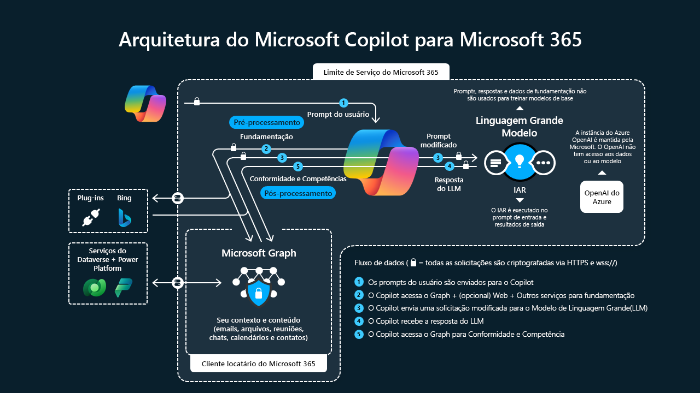

# copilot
Introdução ao Copilot para Microsoft 365.

## Introdução 

> O Microsoft Copilot para Microsoft 365 aplica o poder da IA para aumentar a produtividade, desbloquear a
> criatividade e ajudar os usuários a entender melhor as informações com um chat simples. 
>
> Ao integrar LLMs (modelos de linguagem grande) com dados de locatário do Microsoft Graph e dos aplicativos
> doMicrosoft 365, o Copilot para Microsoft 365 ajuda a transformar palavras de linguagem natural em uma 
> poderosa ferramenta de produtividade.
>
> O Copilot para Microsoft 365 transforma o trabalho de três maneiras significativas:
>
> - Libere a criatividade. O Copilot ajuda você a criar conteúdo com mais rapidez e eficiência.
> - Desbloqueie a produtividade. O Copilot ajuda você a se concentrar no que é mais importante.
> - Aprimore as habilidades. O Copilot torna você melhor naquilo em que já é bom e lhe ajuda a dominar rapidamente o que ainda não aprendeu.
>
>
> ## O que é o Copilot do Microsoft 365?
>
> Ele representa um novo paradigma no trabalho, em que os funcionários colaboram com a IA para aumentar a produtividade. O Copilot resolve o 
> desafio moderno em que o ritmo do trabalho está sobrecarregando a nossa capacidade de acompanhar as mudanças. Desenvolvido com modelos de 
> linguagem grande (LLMS) e utilizando seus dados de negócios do Microsoft Graph, o Copilot tem como objetivo impulsionar a criatividade, 
> aumentar a produtividade e promover novas habilidades.
>
> ## O sistema do Copilot para Microsoft 365
>
> É mais que o ChatGPT do OpenAI inserido no Microsoft 365. Na verdade, o Copilot é um mecanismo de orquestração e processdor sofisticado. Ele mede os pontos fortes dos LLMs com aplicativos do Microsoft 365 e seus dados comerciais proprietários aos quais você, como usuário individual, tem acesso dentro Microsoft Graph.
>
> ## Segurança de dados confiáveis
>
> - Segurança, conformidade e privacidade.
> - O copilot fornece respostas precisas, pertinentes e contextualmente cintes.
> 
> ## Como o Copilot entende o contexto e as necessidades do usuário
>
> - Analisando conteúdo. Seja o documento que você está elaborando, o email que você está redigindo ou a reunião da qual você está 
> participando, o Copilot esmiúça o assunto, o tom, a estrutura e a semântica para determinar sua intenção e o significado.
>
> Analisando conteúdo. Seja o documento que você está elaborando, o email que você está redigindo ou a reunião da qual você está participando,
> o Copilot esmiúça o assunto, o tom, a estrutura e a semântica para determinar sua intenção e o significado.
>
> ## A maneira de trabalho
>
> - Usa recursos de pesquisas poderosos que identificam fontes de conteúdo e dados úteis.
> - Os LLMs permitem que o Copilot crue recomendações com um fraseamento natural, garantindo que qualquer conteúdo gerado se alinhe à sua situação única.
>
>
> Recursos que o Copilot fornece:
>
> - Envolvimento aprimorado nas reuniões.
> - Gerenciamento de email eficiente.
> - Assistência à redação.
> - Desenvolvimento de apresentações.
> - Análise de dados e visualização.
> - Segurança e conformidade.
> - Controle do usuário.
>
> 
> ## Arquitetura lógica
>
> 
> 
>
> ## Modelos de linguagem grande
>
> Os modelos de linguagem grande (LLMs) representam uma classe de modelos de inteligência artificial especializados em entender e gerar textos
> semelhantes ao de humanos. O "grande" no LLM significa tanto o tamanho dos modelos em termos do número de parâmetros que eles abrangem,
> quanto o grande volume de dados nos quais eles são treinados. LLMs, incluindo modelos como ChatGPT, são um tipo de IA generativa. Em vez de 
> meramente prever ou classificar, a IA generativa, como LLMs, pode produzir conteúdo totalmente novo. Quando aplicados ao texto, as LLMs podem
> gerar respostas contextualmente relevantes e sintaticamente corretas com base nos prompts fornecidos.
>
> ## Processamento de linguagem natural
>
> O NLP (Processamento de linguagem natural) é uma tecnologia de IA dinâmica que ajuda os computadores a entender, interpretar e responder à
> linguagem humana de uma maneira significativa. Alguns dos componentes envolvidos são:
> 
> - Geração de tokens. Simplifica parágrafos complexos ao dividir o texto em partes menores, como palavras ou frases.
> - Análise semântica. Ajuda o Copilot a entender o significado ou o contexto subjacente.
> - Análise de sentimento. Avalia o humor ou a emoção por trás de um texto, o Copilot pode entender a intenção do usuário com mais precisão.
> - Tradução de idiomas. Ajuda em tarefas multilíngues, permitindo que o Copilot ajude os usuários em diferentes idiomas.
>
> Ele preenche a lacuna entre a linguagem humana e a compreensão do computador
>
> 
> ## Microsoft Graph
>
> - O Microsoft Graph é essencialmente o tecido conjuntivo que une todos os seus serviços e dados do Microsoft 365.
> - A API do Microsoft Graph traz mais contexto dos sinais do usuário para o prompt, como informações de emails, chats, documentos e reuniões.
>
> ## Microsoft Copilot com chat baseado no Graph 
>
> - O Microsoft Copilot com chat baseado no Graph é a experiência de chat no Copilot para Microsoft 365.
> - Ele permite que os usuários usem a inteligência entre aplicativos. A interface do chat conversacional permite que o Copilot para Microsoft 
> 365 entenda a intenção do usuário e forneça diálogo contínuo. O formato de chat aprimora o contexto. Esse recurso fornece aos usuários uma 
> maneira mais simples de trabalhar com vários aplicativos.
>
>
> ## Microsoft comprometida com a IA responsável
>
> Os grandes orientadores são:
> 
> - Imparcialidade. A Microsoft tem como objetivo eliminar os preconceitos, garantindo o mesmo tratamento para todos os usuários.
>
> - Confiabilidade & Segurança. Confiabilidade Segurança: testes rigorosos garantem que a IA da Microsoft seja executada de forma consistente e
> segura.
>
> - Privacidade & Segurança. Seus dados estão protegidos. Em fases de treinamento e pós-implantação, a Microsoft foca na proteção das 
> informações do usuário.
>
> - Inclusão. As ferramentas de IA são criadas para serem acessíveis e benéficas para todos, independentemente da capacidade física, gênero ou
> origem.
>
> - Transparência. A Microsoft acredita em manter os usuários informados sobre como seus sistemas de IA funcionam e suas finalidades pretendida.
>
> - Responsabilidade. Padrões éticos e legais estão à frente, com desenvolvedores e designers de IA responsabilizados por suas criações.
>
>
> 
>
